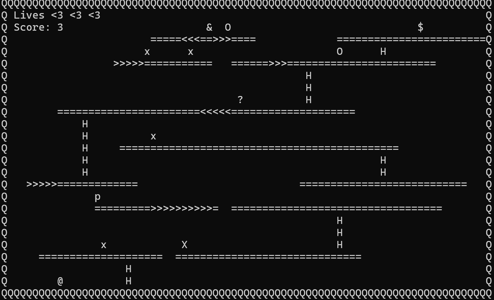

# Donkey Kong - ASCII Game

A terminal-based ASCII implementation of the classic Donkey Kong game.

## Creators
- Gal Libal
- Ben Garusi 

## Gameplay
- Navigate your character (`@`) through different platforms.
- Collect hammers (`p`) to help clear your path.
- You have 3 lives to complete the challenge.

## Controls
| Action          | Key  |
|-----------------|------|
| Move Up         | `W`  |
| Move Left       | `A`  |
| Stay            | `S`  |
| Move Right      | `D`  |
| Move Down       | `X`  |
| Use Hammer      | `P`  |
| Pause Game      | `Esc`|

## How to Win
Reach Pauline (`$`) to win the level.

## Important Notes
1. Mario can stop in the middle of a ladder; he can also move left and right on the ladder but that will lead him to fall.
2. Jumping requires 2 spaces above and 4 spaces forward to execute. If there's not enough space, Mario continues in his current direction.
3. If Mario moves down (`X`) without a ladder below, he continues moving in his current direction.
4. Pause and Resume: Press `ESC` to pause the game. While paused, press `9` to return to the main menu.
5. The jump is not considered part of the fall, meaning the fall will only start after the jump is over.
6. Hammer shows only once per screen. If you collect the hammer and die, you lose it.
7. Score: Every ten loops of the game you get one score point, and each kill with the hammer gives you 10 points.
8. Climbing ghosts automatically move up when they reach a ladder.
   

## Features
- **Death Reason Feedback:** When Mario dies, the game briefly pauses, showing the death location and reason at the legend screen. This helps players improve their strategy.
- **Surprise Feature:** At every level, the player can earn up to 300 points by collecting the `?` symbol that randomly appears.
- **ASCII Art Screens:** Enhanced visual experience with carefully crafted ASCII art.

## Game Screens
- **Main Menu:** Options to start game, select levels, view instructions, or exit.
- **In-game Interface:** Displays remaining lives and current score.
- **Game Over Screen:** Indicates the end of the game.
  

## ASCII Art and UI
The game is fully designed using ASCII characters, providing a nostalgic and retro gaming experience directly within your terminal.

## Starting the Game
- Run the executable file from your terminal.
- Choose your desired option from the main menu to start playing.
  

Enjoy playing Donkey Kong in ASCII style!

**Good luck and have fun!** ??
